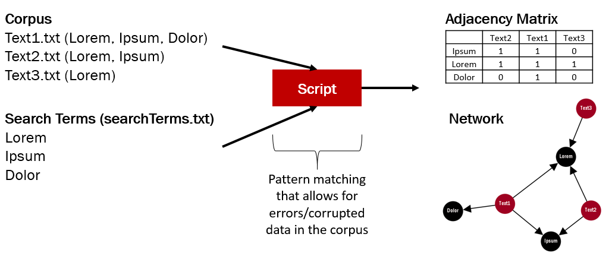

# Introduction
HGSimpleCorpusNetwork can be used to do batch frequency analysis on corrupted corpus data. Given a set of search terms and a set of text files, the script will generate an adjacency matrix (term-document matrix), a gexf file, and a graphml file linking the search terms to the texts.

In order to account for corrupted data (i.e. OCR corrupted data), the search algorithm supports Levenshtein distances and 
gestalt pattern matching to also recognize similar (i.e. distorted) tokens. For example, the algorithm is able to recognize _do1or_* as _dolor_. This allows for fairly accurate frequency estimates, even when dealing with highly corrupted data.

# Requirements
* Python 2.x
* Python modules: networkx, numpy, nltk, matplotlib

# Usage
Run `runHGSCN.py` and supply the following arguments:

* -t Tokenizer (either 'simple' or 'nltk')
* -ma Matching Algorithm (either 'gestalt' or 'levenshtein')
* -mt Matching Threshold (n steps for levenshtein or 0-1 for gestalt)
* -pre Show Preview (either 1 or 0)
* -icase Ignore Case (either 1 or 0)
* file_dir (the corpus directory)
* project_name (a descriptive name for the batch)
* search\_terms\_file (a text file with one search term per line)

# Behaviour
Both matching algorithms can be set to ignore case. In this case, it is possible that there will be findings with a lower threshold than the one set by the user. 
Example: Comparing 'test' to 'teST' would result in a 0.5 match. Given a 0.8 threshold, the instance would not be counted. However, since case is ignored, the two terms do match. The instance will be counted and added to the findings table with the correct (0.5) measure.

# Runtime
The script utilizes a simple linear search algorithm. Hence, the tool currently performs at O(n). The number of files is neglectable, what counts is the number of words and the number of search terms. Doubling the number of words will approximately double the runtime of the script. The same holds true for additional search terms.

# Known Flaws and Problems
* The script currently fails when it encounters malformed utf8 characters. Make sure that all corpus files are correctly encoded.
* The default value for the tokenizer (nltk) is not correctly passed to the script (you have to specify a tokenizer for it to work)
